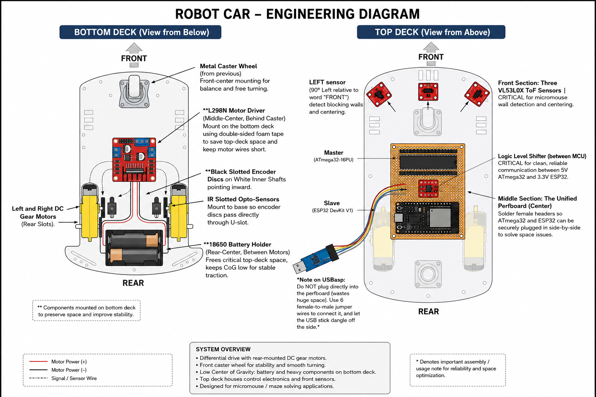

# 2WD Chassis Physical Layout Design

This document provides the exact physical placement strategy for all components on your 2WD acrylic chassis. Proper weight distribution and sensor placement are critical for minimizing wheel slip and ensuring accurate wall detection.

## 1. Bottom Deck (Mechanics, Traction, & Power)

The bottom deck houses the core mechanics, ground-facing sensors, and the heavy battery pack to keep the center of gravity low.

*   **Rear-Center (Between Motors):** Mount the **18650 Battery Holder** here using **double-sided foam tape**. Placing this heavy item on the bottom deck frees up critical space on the top deck and keeps the tires pressed firmly into the ground for better traction.
*   **Left & Right Rear Slots:** Mount the two yellow DC gear motors here.
*   **Inner Motor Shafts:** The black slotted encoder discs push onto the small white shafts pointing *inward* toward the center of the chassis.
*   **Next to Encoders:** Mount the IR Slotted Opto-Sensors to the chassis base so that the encoder discs pass directly through the U-shaped slot.
*   **Front Center:** Mount the metal caster wheel.
*   **Middle Center (Behind Caster):** Mount the **L298N Motor Driver** using **double-sided foam tape**. Keeping it on the bottom deck saves top-deck space and keeps motor wires short.

---

## 2. Top Deck (The Brains)

The top deck is incredibly tight on space. Since a single breadboard takes up almost the entire surface, we must use alternative mounting strategies for the ESP32.

### Middle Section (The Unified Perfboard)
*   **Center:** Mount a single **Perfboard**. By soldering, we completely eliminate the massive, unreliable breadboard.
*   **On the Perfboard:** 
    *   Solder female headers so you can securely plug in both the **ATmega32 (Master)** and the **ESP32 (Slave)** side-by-side. This solves the ESP32 space issue instantly.
    *   Place the **Logic Level Shifter** between them for clean, short, reliable wiring.
    *   *Note on USBasp:* Do NOT plug the USBasp programmer into the perfboard (it wastes huge amounts of space). Use 6 female-to-male jumper wires to connect it, and let the USB stick dangle off the side of the robot.

### Front Section (Sensor Placement)
For a micromouse, sensor placement is absolutely critical for the flood fill algorithm. Mount the three **VL53L0X ToF Sensors** on the very front edge of the top deck using **M3 standoffs and screws**:
*   **Front Sensor:** Exactly center, facing 0° straight forward. Used to detect walls blocking your path.
*   **Left Sensor:** Mounted on the front-left corner, angled exactly **90° to the left**. Used for wall-following and centering.
*   **Right Sensor:** Mounted on the front-right corner, angled exactly **90° to the right**.
*   *Crucial:* Ensure these are mounted perfectly level so they hit the maze walls, not shoot over them or hit the floor.

---

